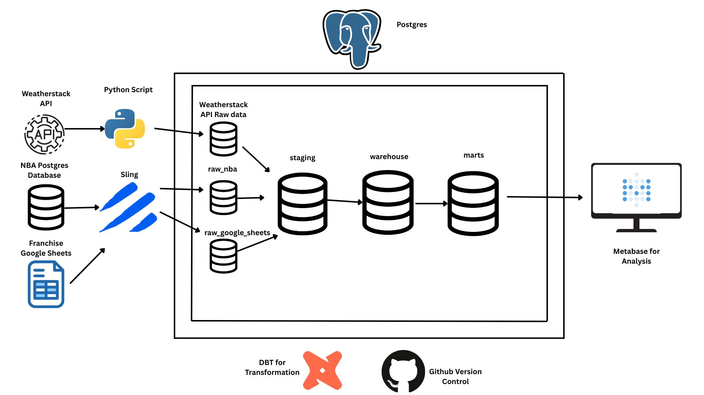

## Our Data Pipeline Project

This repository consists of a Data Pipeline Project that loads raw data using Sling and uses a Python script to load Weatherstack API data and uses dbt to transforms raw data sources loaded using Sling and Python script into clear, formatted models for Analytics.

To learn more about the overall architecture design & strategy, check our centralized handbook:
- [Data Architecture Handbook](https://docs.google.com/document/d/1GY9_11JGQi0TgqWVrzwd9BEdQ5UqKxSXLV8cctR9CqY/edit?usp=sharing)

---

### Sources:
Raw, unformatted data loaded directly from source systems using various data tools.

- **`nba_data`** – The primary source of NBA statistics data captured from a hosted postgres server and loaded via Sling.
  - Schema: `analytics.raw_nba_data`

- **`google_sheets`** – Internally maintained reference sheets related to the project, loaded via Sling.
  - Schema: `analytics.raw_google_sheets`

- **External API Data** – Additional datasets loaded via Python scripts as part of the CI and Production workflows.
  - These use secure API keys passed through GitHub Secrets and are integrated into the data pipeline for timely ingestion.
  - Schema: `analytics.weather`

---

### Environments:
Transformed data models and raw ingested data are organized into distinct environments for a sustainable development workflow.

- **Development**
   - Schema: `analytics.dev_[your-name]`
   - One per developer to avoid conflicts or overriding changes.

- **CI**
   - Schema: `analytics.ci`
   - An isolated schema for validating Pull Request changes.
   - **Automated workflow job sequence:**
     1. Load data using Sling
     2. Ingest external API data via Python script
     3. Run dbt build and test to validate models on data ingested using Sling

- **Production**
   - Schemas: 
     - `analytics.staging`
     - `analytics.warehouse`
     - `analytics.marts`
   - **Automated workflow job sequence:**
     1. Load data using Sling
     2. Ingest external Weatherstack API data via Python script
     3. Run dbt transformations and tests on data ingested using Sling

---

### How to Get Started?
1. **Set up your local development environment**
   - Use your preferred IDE (e.g. VS Code), dbt Cloud, or GitHub Codespaces
2. **Clone the current repo (or create a new one)**
   - Checkout the `main` branch and run `git pull` to sync changes
3. **Create a new branch for your changes**
   - `git branch your_branch_name` then `git checkout your_branch_name`
4. **Start developing**
   - Follow team conventions and [Style Guide](_project_docs/style_guide.md)
5. **Create a Pull Request**
   - Push your branch and request review
   - CI workflow will run the full job sequence:
     - Sling sync
     - API data ingestion
     - dbt build and tests
6. **Merge to `main`**
   - Post-merge, Production workflow will run the same job sequence
7. **Pull latest updates**
   - `git checkout main` then `git pull`
8. **Repeat the cycle**

---

### Notes
- **API Secrets & Credentials**: Stored securely using GitHub Secrets and injected into CI/CD workflows.
- **Sling Configs**: Refer to `sling env_template.yaml` and replication files for setting up data source syncing.

---

### Resources:
- Learn more about Sling in the [Sling Documentation](https://docs.slingdata.io/)
- Refer to the [Weatherstack API Documentation](https://weatherstack.com/documentation) for data ingestion setup
- Learn more about dbt [in the docs](https://docs.getdbt.com/docs/introduction)
- Check out [Discourse](https://discourse.getdbt.com/) for commonly asked questions
- Join the [chat](https://community.getdbt.com/) on Slack
- Read [the blog](https://blog.getdbt.com/) for updates and best practices
